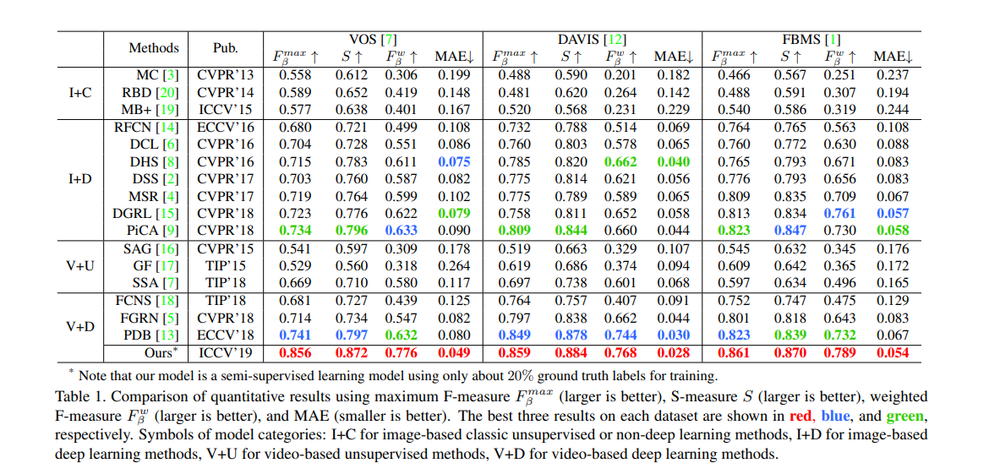

# RCRNet-Pytorch

## Introduction

This repository is the PyTorch implementation of "Semi-Supervised Video Salient Object Detection Using Pseudo-Labels", International Conference on Computer Vision(ICCV), 2019, by Pengxiang Yan, Guanbin Li, Yuan Xie, Zhen Li, Chuan Wang, Tianshui Chen, Liang Lin.

Paper links: [[arxiv](https://arxiv.org/abs/1908.04051)] or [[CVF](http://openaccess.thecvf.com/content_ICCV_2019/html/Yan_Semi-Supervised_Video_Salient_Object_Detection_Using_Pseudo-Labels_ICCV_2019_paper.html)]

## Usage

### Requirements

This code is tested on Ubuntu 16.04, Python=3.6 (via Anaconda3), PyTorch=0.4.1, CUDA=9.0.

```
# Install PyTorch=0.4.1
$ conda install pytorch==0.4.1 torchvision==0.2.1 cuda90 -c pytorch

# Install other packages
$ pip install pyyaml==3.13 addict==2.2.0 tqdm==4.28.1 scipy==1.1.0
```
### Datasets
Our proposed RCRNet is evaluated on three public benchmark VSOD datsets including [VOS](http://cvteam.net/projects/TIP18-VOS/VOS.html), [DAVIS](https://davischallenge.org/) (version: 2016, 480p), and [FBMS](https://lmb.informatik.uni-freiburg.de/resources/datasets/). Please orginaize the datasets according to `config/datasets.yaml` and put them in `data/datasets`. Or you can set argument `--data` to the path of the dataset folder.

### Evaluation
#### Comparison with State-of-the-Art

If you want to compare with our method:

**Option 1:** you can download the saliency maps predicted by our model from [Google Drive](https://drive.google.com/open?id=1feY3GdNBS-LUBt0UDWwpA3fl9yHI4Vxr) / [Baidu Pan](https://pan.baidu.com/s/1oXBr9qxyF-8vvilvV5kcPg) (passwd: u079).

**Option 2:** Or you can use our trained model for inference. The weights of trained model are available at [Google Drive](https://drive.google.com/open?id=1TSmi1DyKIvuzuXE1aw7t_ygmcUmjYnN_) / [Baidu Pan](https://pan.baidu.com/s/1PLoajL6X_s29I-4mreSuSQ) (passwd: 6pi3). Then run the following command for inference.
```
# VOS
$ CUDA_VISIBLE_DEVICES=0 python inference.py --data data/datasets --dataset VOS --split test

# DAVIS
$ CUDA_VISIBLE_DEVICES=0 python inference.py --data /data/datasets --dataset DAVIS --split val

# FBMS
$ CUDA_VISIBLE_DEVICES=0 python inference.py --data /data/datasets --dataset FBMS --split test
```

Then, you can evaluate the saliency maps using your own evaluation code.

### Training
If you want to train our proposed model from scratch (including using pseudo-labels), please refer to our paper and the [training instruction](docs/training_instruction.md) carefully.

## Citation
If you find this work helpful, please consider citing
```
@inproceedings{yan2019semi,
  title={Semi-Supervised Video Salient Object Detection Using Pseudo-Labels},
  author={Yan, Pengxiang and Li, Guanbin and Xie, Yuan and Li, Zhen and Wang, Chuan and Chen, Tianshui and Lin, Liang},
  booktitle={Proceedings of the IEEE International Conference on Computer Vision},
  pages={7284--7293},
  year={2019}
}
```

## Acknowledge
Thanks to the third-party libraries:
* [deeplab-pytorch](https://github.com/kazuto1011/deeplab-pytorch) by kazuto1011
* [flownet2-pytorch](https://github.com/NVIDIA/flownet2-pytorch) by NVIDIA
* [pytorch-segmentation-toolbox](https://github.com/speedinghzl/pytorch-segmentation-toolbox) by speedinghzl
* [Non-local_pytorch](https://github.com/AlexHex7/Non-local_pytorch) by AlexHex7