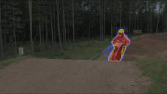
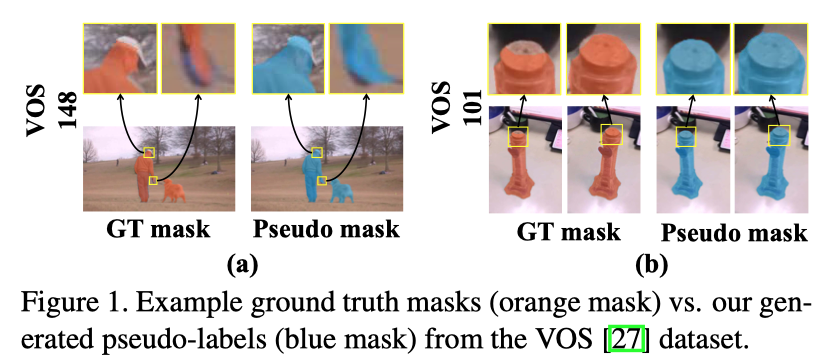
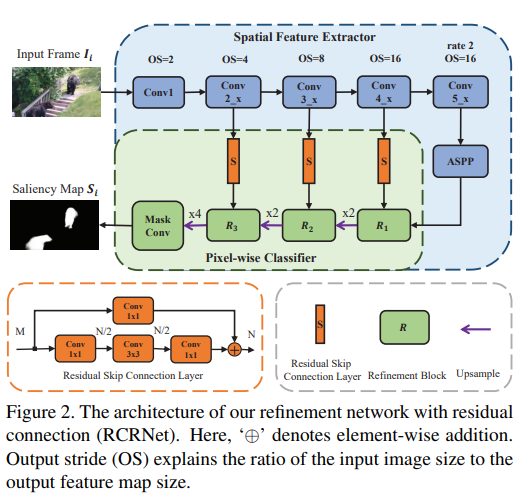
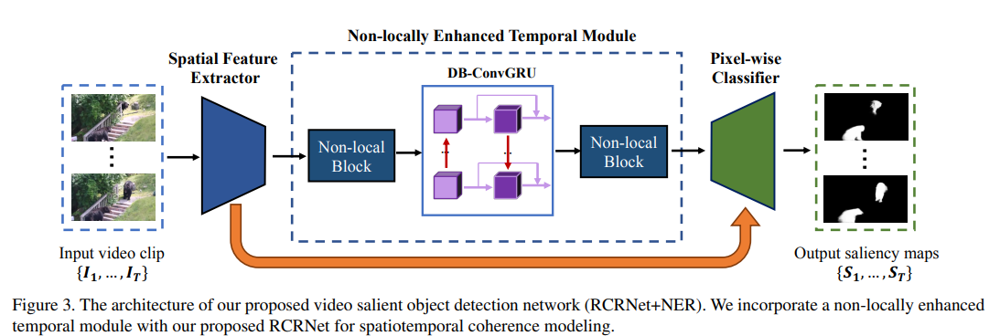
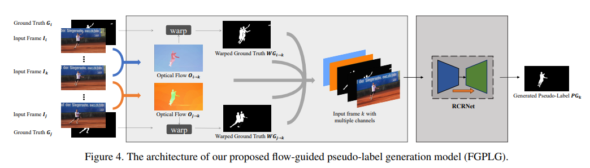

## Abstract

Deep learning-based video salient object detection has recently achieved great success with its performance significantly outperforming any other unsupervised methods. However, existing data-driven approaches heavily rely on a large quantity of pixel-wise annotated video frames to deliver such promising results. In this paper, we address the semi-supervised video salient object detection task using pseudo-labels. Specifically, we present an effective video saliency detector that consists of a spatial refinement network and a spatiotemporal module. Based on the same refinement network and motion information in terms of optical flow, we further propose a novel method for generating pixel-level pseudo-labels from sparsely annotated frames. By utilizing the generated pseudo-labels together with a part of manual annotations, our video saliency detector learns spatial and temporal cues for both contrast inference and coherence enhancement, thus producing accurate saliency maps. Experimental results demonstrate that our proposed semi-supervised method even greatly outperforms all the state-of-the-art fully supervised methods across three public benchmarks of VOS, DAVIS, and FBMS.

## Paper

Pengxiang Yan, Guanbin Li, Yuan Xie, Zhen Li, Chuan Wang, Tianshui Chen, Liang Lin, **Semi-Supervised Video Salient Object Detection Using Pseudo-Labels**, the IEEE International Conference on Computer Vision (ICCV), 2019, pp. 7284-7293. [[Arxiv](https://arxiv.org/abs/1908.04051)] [[Code](https://github.com/Kinpzz/RCRNet-Pytorch)] [[BibTex](https://github.com/Kinpzz/RCRNet-Pytorch/raw/master/docs/bibtex.txt)]

## Motivation

* Existing data-driven approaches of video salient object detection heavily rely on a large quantity of densely annotated video frames to deliver promising results.

* Consecutive video frames share small differences but will take a lot of efforts to densely annotate them and the labeling consistency is also hard to guarantee. 

## Contributions

- We propose a refinement network (RCRNet) equipped with a nonlocally enhanced recurrent (NER) module for spatiotemporal coherence modeling. 

- We propose a flow-guided pseudo-label generator (FGPLG) to generate pseudo-labels of intervals based on sparse annotations.

- As shown in Figure. 1, our model can produce reasonable and consistent pseudo-labels, which can even improve the boundary details (Example a) and overcome the labeling ambiguity between frames (Example b).

- Experimental results show that utilizing the joint supervision of pseudo-labels and sparse annotations can further improve the model performance. 

## Architecture

### RCRNet

### RCRNet+NER

### Flow-Guided Pseudo-Label Generator

## Results

### Quantitative Comparison

## Downloads

* Pre-computed  saliency maps the validation set of DAVIS2016, the test set of FBMS, and the test set of VOS. [[Google Drive](https://drive.google.com/open?id=1feY3GdNBS-LUBt0UDWwpA3fl9yHI4Vxr)] [[Baidu Pan](https://pan.baidu.com/s/1oXBr9qxyF-8vvilvV5kcPg) (passwd: u079)]

## Q&A

Q1: What is the difference between the semi-supervsied strategies mentioned in semi-supervsied video salient object detection (VSOD) and semi-supevised video object segmentation (VOS)?

A1: VOS can be categories into **semi-supervised** and **unsupervised** methods when referring to different **testing** schemes. Semi-supervised VOS will provide the annotation of the first frame when testing. Video salient object detection (VSOD) is more similar to unsupervised VOS as both of them do not resort to labeled frames during testing. Here, our proposed method use only a part of labeled frames for **training** and that makes we call it a semi-supervised VSOD method.

Q2: Are all the V+D methods in Table 1 fully-supervised? It might lack comparison with other semi-supervised video salient object detection methods (VSOD) and mask propagation based segmentation methods.

A2: As far as we know, when referring to the training scheme, we are the first to adopt a semi-supervised strategy for VSOD. Thus, all the V+D methods in Table 1 (except ours) are trained under full supervision. Since most mask propagation based methods are designed for semi-supervised VOS, we only compare with unsupervised VOS methods in Section 5 of the paper.

Q3: Is PDB fully-supervised or unsupervised?

A3: PDB is fully-supervised during training but unsupervised during testing. Specifially, PDB is an algorithm for both video salient object detection and unsupervised video object segmentation and it is trained under fully supervision.

## Contact

If you have any question, please send us an email at yanpx(AT)mail2.sysu.edu.cn